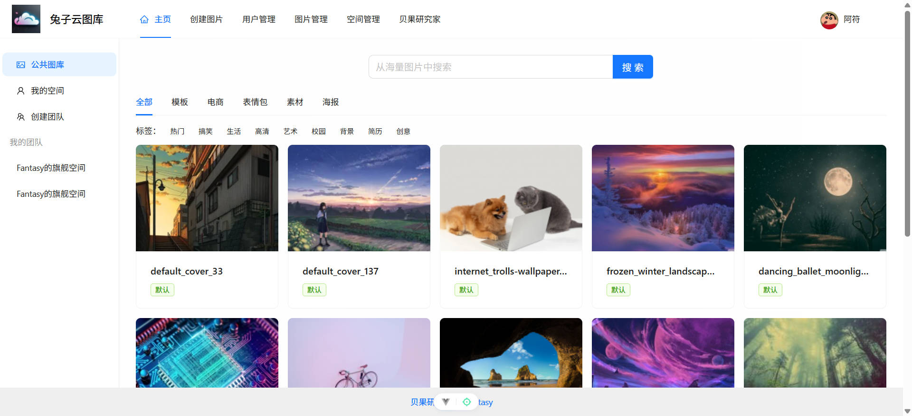
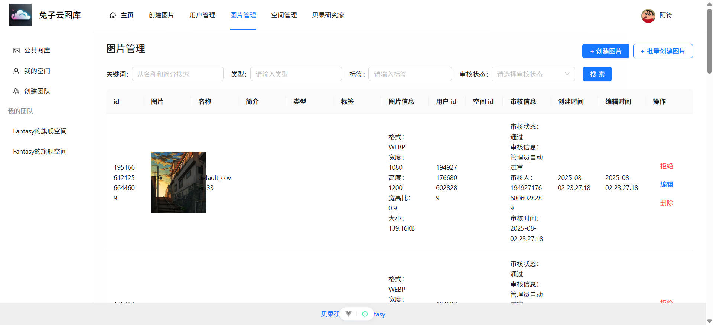
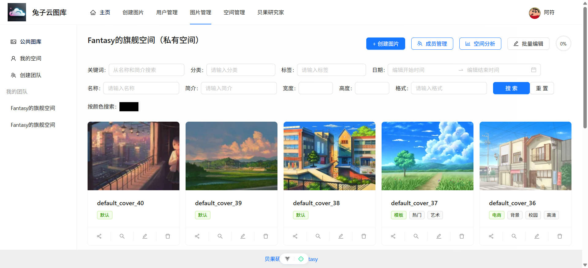
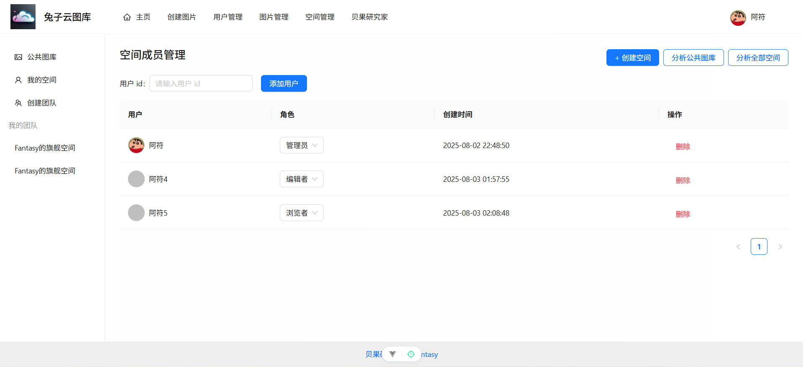
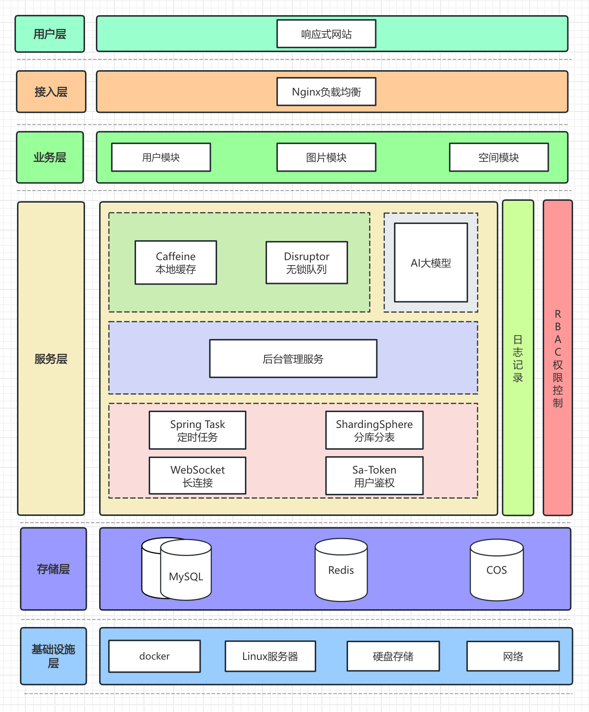

# 兔子云图库项目介绍

本项目代码开源：

- 前端：[https://github.com/777nx/rabbit-picture-frontend](https://github.com/777nx/rabbit-picture-frontend)
- 后端：[https://github.com/777nx/rabbit-picture-backend](https://github.com/777nx/rabbit-picture-backend)

## 项目概述

本项目是一个基于 **Vue 3 + Spring Boot + COS + WebSocket** 构建的 **企业级智能协同云图库平台**。

平台具备广泛的应用场景，其核心功能可划分为四大类别：

1.  **公共素材库：**
    *   所有用户均可公开上传、检索图片素材，快速定位所需资源。
    *   适用于表情包网站、设计素材库、壁纸分享平台等场景。
    *    

2.  **管理后台：**
    *   管理员可进行图片上传、审核、管理及系统内图片分析。
    *    

3.  **个人空间：**
    *   个人用户可将图片上传至私有空间，进行批量管理、检索、编辑和分析。
    *   适用于个人网盘、相册管理、作品集展示等场景。
    *    

4.  **团队协作：**
    *   企业可开通团队空间并邀请成员加入。
    *   支持团队成员间图片共享与 **实时协同编辑**，显著提升团队协作效率。
    *   适用于企业活动相册、内部素材库建设等商业服务场景。
    *    

**项目架构设计图：**

## 技术选型

### 后端技术栈

*   **核心框架：** Java Spring Boot
*   **数据存储：**
    *   MySQL 数据库
    *   MyBatis-Plus ORM 框架
    *   MyBatis X 插件
*   **缓存：**
    *   Redis 分布式缓存
    *   Caffeine 本地缓存
*   **对象存储：** ⭐️ COS (对象存储服务)
*   **数据处理：**
    *   ⭐️ ShardingSphere (分库分表)
    *   Jsoup (数据抓取)
*   **系统安全与权限：** ⭐️ Sa-Token (权限认证与控制)
*   **实时通信：** ⭐️ WebSocket (双向实时通信)
*   **高性能处理：**
    *   ⭐️ Disruptor (高性能无锁队列)
    *   ⭐️ JUC (Java并发工具包，支持并发与异步编程)
*   **AI能力集成：** ⭐️ AI绘图大模型接入
*   **设计模式：** ⭐️ 综合运用多种设计模式
*   **优化维度：** ⭐️ 多角度项目优化 (涵盖性能、成本、安全性等)

### 前端技术栈

*   **核心框架：** Vue 3
*   **构建工具：** Vite
*   **UI组件库：** Ant Design Vue
*   **HTTP客户端：** Axios
*   **状态管理：** Pinia
*   **功能组件：** 数据可视化组件、图片编辑器等
*   **工程化：** ⭐️ ESLint + Prettier + TypeScript
*   **API集成：** ⭐️ OpenAPI 前端代码自动生成
